---
meta:
    author: Emma Krebs
    topic: 3D Atmospheric Fluid Simulation using an Eulerian Octree to Model Heat Diffusion
    course: TN Tech PHYS4130
    term: Spring 2026
---

# 3D Atmospheric Fluid Simulation using an Eulerian Octree to Model Heat Diffusion

## Introduction of Atmospheric Modeling and Data Management

Atmospheric models are mathematical frameworks used to simulate and predict the behavior of Earth's atmosphere. It uses primitive equations, which are a set of nonlinear partial differential equations that are used to approximate global atmospheric flow. They consist of three balance equations:

1. The continuity equation: Representing the conservation of mass.
2. Conservation of Momentum: Consisting of a form of the Navier–Stokes equations that describe hydrodynamical flow on the surface of a sphere under the assumption that         vertical motion is much smaller than horizontal motion (hydrostasis) and that the fluid layer depth is small compared to the radius of the sphere.

$$

3. Thermal Energy Equation: Relating the overall temperature of the system to heat sources and sinks. 

[Definitions from source one, Wiki of Primitive Equations]

Atmospheric models supplement these equations with additional factors of natural proccesses that affect weather. For example, this could include turbulent diffusion, radiation, moist processes (clouds and precipitation), heat exchange, soil, vegetation, surface water, the kinematic effects of terrain, and convection. This can make an accurate computational model for atmospheric modeling incredibly complex and taxing on even supercomputers. Working in 3D increases this complexity where the number of points to keep track of is $N^3$, so we need a smarter data structure to be able to run these simulations. Although grids and arrays in Python can outperform some data structures when there is less data to manage, these structures eventually slow down the processing time since it tracks each invidual point. This isn’t the best use of our memory if we are only interested in regions of activity (ie, storm formation, intense wind shear, etc). We need a data structure that stores all of this information, isn’t computationally taxing, and can adapt to activity. This is where a Eulerian Octree becomes useful. 

## Eulerian Octree

There are now two words we need to define for our data structure: Eulerian and Octree. Eulerian describes one of two different perspectives of the code we can have. Eulerian is the idea that our data structure cares about what is flowing through it rather than tracking what is moving. In other words, our data structure will be a fixed region of interest and we will measure what moves through it. Lagrangian, the second perspective, is tracking individual objects and how they move through space. The Lagrangian perspective is what we used for the previous diffusion project. To help clarify this idea, consider the figure below. 

Our next word to define is octree. An octree is a tree structure that partitions 3D space by recursively dividing it into 8 children nodes. It starts with a root node at some point in the space. The root is typically intialized at the center but that is not a requirement, the center makes it easier to divide the space recursively without too much work. Then, when a certain criteria is met the space is subdivided into 8 children nodes, thus turning the space finer. The parent node, in this case the root, keeps track of its children so that you can always recursively travel through the space. This will be useful when updating parameters in regions and trasnversing the space. Additionally, because they are object classes we can store many other paramters within the node without much difficulty. This could be information on the current size of the node, its neighbors, or even the enviornmental parameters we are interested in simulating. Again, see the figure below for clarification of the node structure and how it subdivides the space.

The idea for this project was initially found through AI pathfinding from video game development. Say an AI needs to take the shortest path to a player, but there are objects it needs to avoid. The AI could either check each point in space for a possible object, or we could define regions without 

## Summary of Code

The code is divided into three main files: OctreeFunctions.py, StormFunctions.py, and Main.py. OctreeFunctions contains all the function definitions for the management of the octree and the class object for the spatial nodes. It was decided that this project would focus on the heat diffusion aspect of atmospheric models to test the octree structure. The StormFunctions file contains two heat equations from different iterations of this project. The first is not a closed system and has fluctuating heat, meaning the initial results were not a conserved system for heat diffusion. The second heat function is the improved iteration that, although not perfect, does maintain a more accurate conserved system then the first. The Main.py imports the previous files, initiates a hot spot somewhere in space, and updates the octree. Additionally, it creates the graphs seen later for measuring octree growth and total heat. Main.py was ran three times with a maximum octree depth of 3, 4, and 5, meaning they could not subdivide past that depth. 

### OctreeFunctions

### StormFunctions

There are two heat diffusion functions within this file: diffuse and diffuse_conservation. Diffuse is the first iteration of the code 

### Main

## Resulting Animations and Graphs

There are various animations and graphs resulting from this project. We will beging with the first iteration of the project where the heat diffusion was not conserved. We can see the following three animations for n=3, n=4, n=5 where the color represents the normalized difference in temperature:

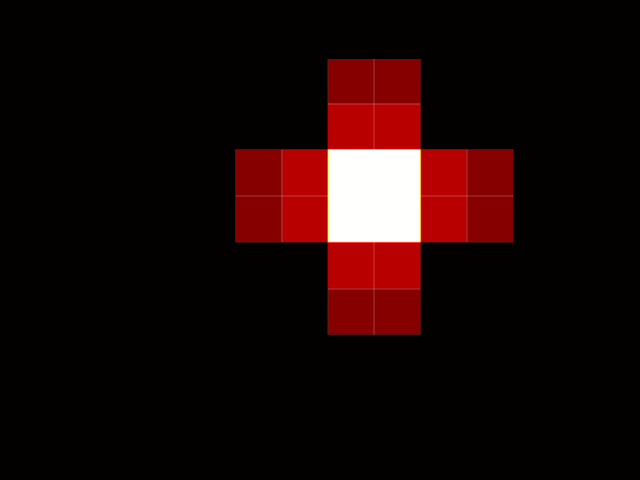  

Fig (FIX). Octree development for nonconserved heat diffusion given a maximum depth of 3, 4, and 5 for the octree. Colors are based on a normalization between 0 and 1 and don't necessarily represent the true temperature of each node. 

Note that all of these are on the same time scale, meaning that the number of nodes effects the rate of diffusion. We can see more about this in the following three graphs:

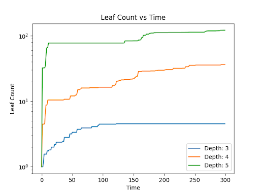 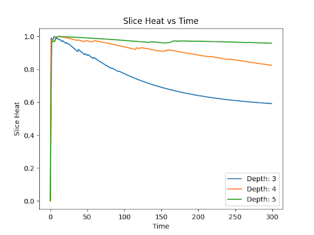 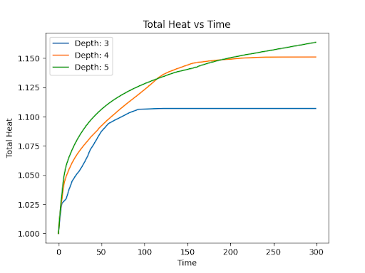

Fig (FIX). Nonconserved heat diffusion for three depths. The first graph represents the adaptability of the octree and how many leaf nodes there are as the octree develops. The second represents the slice where the hot node is introduced and how much heat is in that slice as it diffuses. Finally, the last graph contains the total heat in the system. As we can see, it is not conserved and increases over time with it even having differences between the depths (most likely because the calculation depending on the size of the node). 

Now we can look at the conserved heat diffusion equation. The colors here are represented differently from the previous program. Instead, these are maximized on the current maximum temperature. As the heat spreads and reaches equilibirum, they should all become the same bright yellow/white color since they all have a similar max temperature.

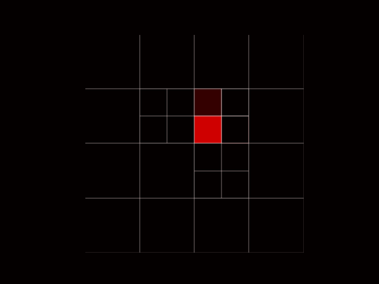 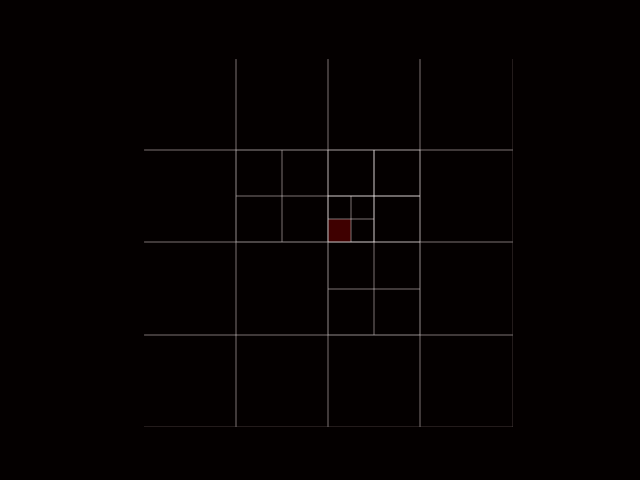 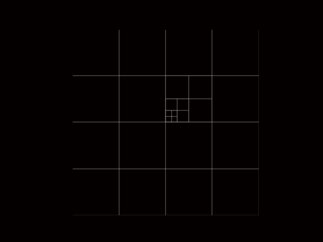

Fig (FIX). Octree development for conserved heat diffusion given a maximum depth of 3, 4, and 5 for the octree. Colors are based on a normalization of the maximum 

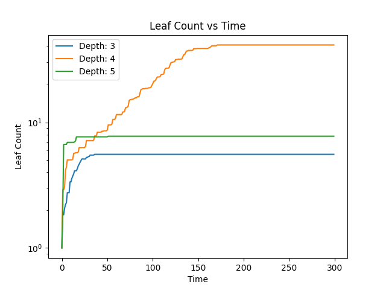 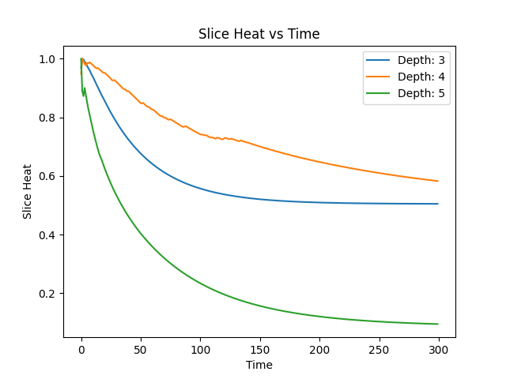 

Fig (FIX).

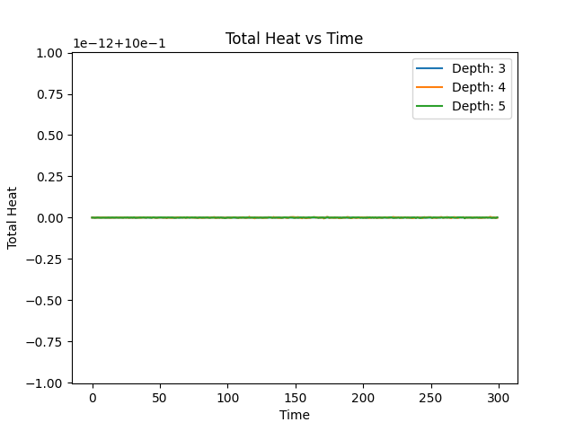 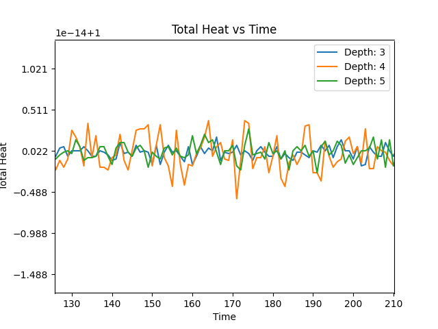

Fig (FIX). 

## Conclusion

There are many areas to improve with this code to create a better atmospheric model. Although they were not implemented here, various additional storm functions could be added without much change to Main.py and OctreeFunctions.py to make a much more accurate model. Some of the possible additional charactersitics involved with storms (some of which were previously mentioned in the introduction) are vorticity, wind speed, and pressure. Although these would help achieve the original intent of this project, it was decided to focus on heat diffusion because of three reasons: 1) time constraint, 2) measurability and consistency, and 3) node borders. 

The last two in particular drove this decision. Heat diffusion is a much simpler process to check consistency of because it is simply the flow of heat between boxes, so checking if its conserved as it flows is much easier then wind velocity where you have to check directions on top of the scalar intensity. Additonally, a major issue with this method of octrees is the neighbors. Any particular node may have more neighbors on one edge of its spatial size then another, making storing and accounting for fluxes much more difficult to keep track of. This code would be moreso an approximation of heat diffusion since it either averages neighbors on a side or simply chooses one as a representation. Therefore, strange behaviors can emerge as seen in the previous section heat_conservation function. The diffusion appears to favor growth in the vertical direction (similar problem to the diffusion example!), which may be due to the number of nodes in a region of space. The direction of spread may favor more nodes. An additional area to improve is how the maximum depth can change the rate of diffusion and total heat, again shown in the previous section. Balancing this data structure to accurate measurements of the physics is an integral step that needs to be improved on. 

In summary, 

-Areas to improve code
-Restate important points of result
-Retate importance of data management 

## Languages, Libraries, Lessons Learned

This project let me investigate data structures and the very tip of the iceberg for atmospheric modeling/fluid dynamics. I was able to read some really cool papers of people's attempts on improving these simulations (seen in sources) and how data structures contribute to a good model. In particular, adapative octrees let me practice a type of data organization using object classes which I haven't been able to use since CS 1310. Getting to revisit that was fun. However, the adaptability also increased the difficulty, so although this was a computational physics project it definietely favoured the computation aspect. Most of the timekeeping was dedicated to constructing the octree and bug fixing the node updates and trying to figure out the adaptability. A semi-new library I used was matplotlib's patches, which was mostly there to help me visualize the octree adapting. 

## Timekeeping

As of 5/31/26: 44 hours

## Soucres

### Websites

https://en.wikipedia.org/wiki/Primitive_equations (Prinitive Equation definitions used in the introduction)

https://staff.cgd.ucar.edu/islas/teaching/2_Equations.pdf (Equation for primite equation)

https://en.wikipedia.org/wiki/Octree (Wiki for Octree)

https://www.osti.gov/servlets/purl/1008123#:~:text=Computational%20simulation%20must%20often%20be,the%20mesh%20generation%20code%2C%20CUBIT. (Computational Information for Eulerian Octree)

https://gmd.copernicus.org/articles/17/6401/2024/ (Adapative Mesh Octree)

### Books

An Introduction to Clouds by Lohmann Luond Mahrt

