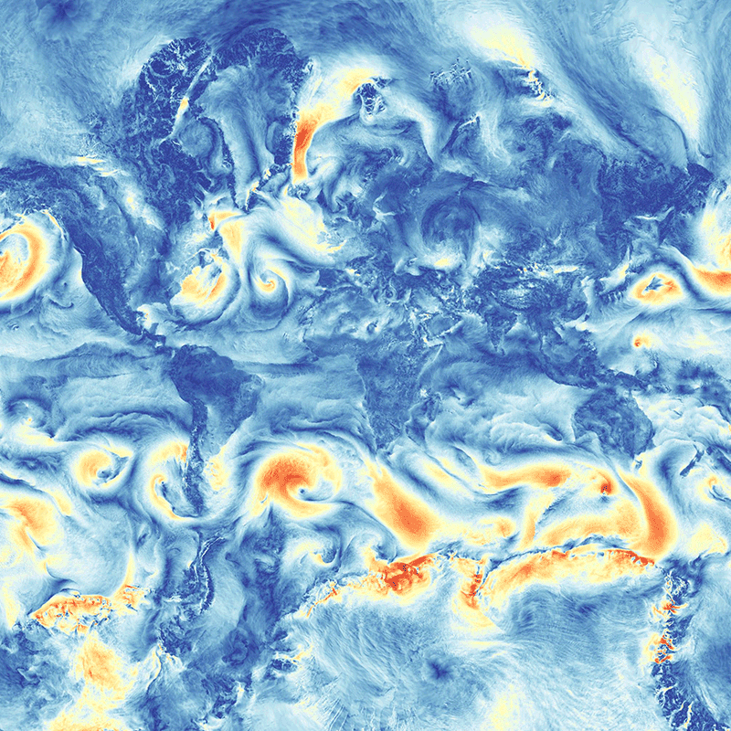
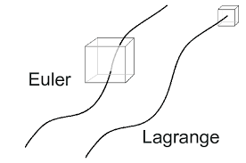
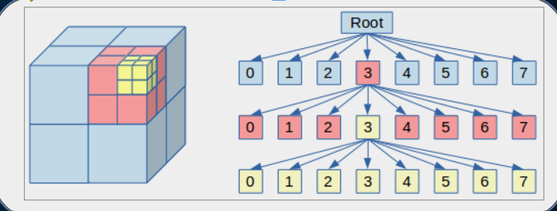
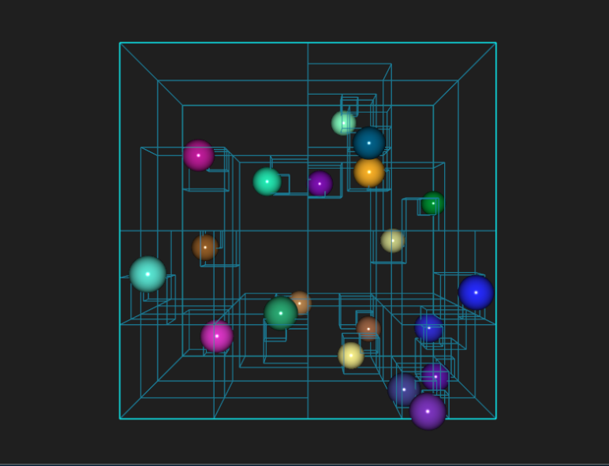
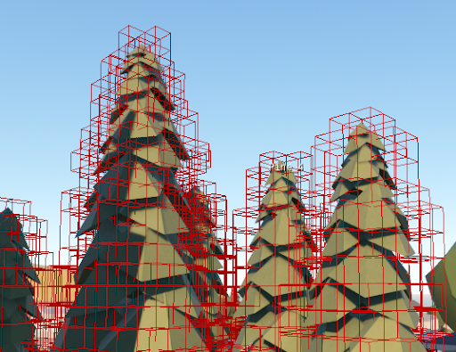
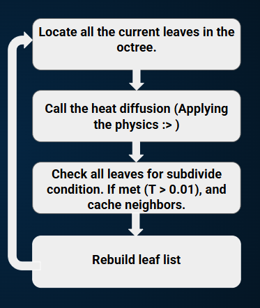

---
meta:
    author: Emma Krebs
    topic: 3D Atmospheric Fluid Simulation using an Eulerian Octree to Model Heat Diffusion
    course: TN Tech PHYS4130
    term: Spring 2026
---

# 3D Atmospheric Fluid Simulation using an Eulerian Octree to Model Heat Diffusion

<p align="center">
  
</p>

Figure 1. From the Max-Planck-Institut climate model ICON. Wind speed near the surface simulated with 1 km resolution. Zooming reveals fine structures, like the inprint of the underlying land, from convective activity.

## Introduction of Atmospheric Modeling and Data Management

Atmospheric models are mathematical frameworks used to simulate and predict the behavior of Earth's atmosphere. It uses primitive equations, which are a set of nonlinear partial differential equations that are used to approximate global atmospheric flow. They consist of three balance equations:

1. **The Continuity Equation:** Represents conservation of mass.

```math
\frac{\partial \rho}{\partial t}
+
\nabla \cdot (\rho \mathbf{v})
=
0
```

2. **Conservation of Momentum:** A form of the Navier–Stokes equations describing fluid flow on the surface of a sphere. The primitive equations assume that vertical motion is much smaller than horizontal motion (hydrostatic balance) and that the fluid layer depth is small compared to the radius of the sphere.

```math
\frac{D\mathbf{v}}{Dt}
+
2\mathbf{\Omega}\times\mathbf{v}
=
-\frac{\nabla p}{\rho}
-
\nabla\Phi
-
\nu\nabla^2\mathbf{v}
```

3. Thermal Energy Equation: Relating the overall temperature of the system to heat sources and sinks.

```math
\frac{D\theta}{Dt}=0
```

[Definitions from source one and two]

Atmospheric models supplement these equations with additional factors of natural proccesses that affect weather. For example, this could include turbulent diffusion, radiation, moist processes (clouds and precipitation), heat exchange, soil, vegetation, surface water, the kinematic effects of terrain, and convection. This can make an accurate computational model for atmospheric modeling incredibly complex and taxing on even supercomputers, an example of which can be seen in the figure above. Working in 3D increases this complexity where the number of points to keep track of is $N^3$, so we need a smarter data structure to be able to run these simulations. Although grids and arrays in Python can outperform some data structures when there is less data to manage, these structures eventually slow down the processing time since it tracks each invidual point. This isn’t the best use of our memory if we are only interested in regions of activity (ie, storm formation, intense wind shear, etc). We need a data structure that stores all of this information, isn’t computationally taxing, and can adapt to activity. This is where a Eulerian Octree becomes useful. 

## Eulerian Octree

There are now two words we need to define for our data structure: Eulerian and Octree. Eulerian describes one of two different perspectives for writing code. Eulerian is the idea that our data structure cares about what is flowing through it rather than tracking what is moving. In other words, our data structure will be a fixed region of interest and we will measure what moves through it. Lagrangian, the second perspective, is tracking individual objects and how they move through space. The Lagrangian perspective is what we used for the previous diffusion project. To help clarify this idea, consider the figure below. 

Our next word to define is octree. An octree is a tree structure that partitions 3D space by recursively dividing it into 8 children nodes. Eulerian Octrees can be an adaptive mesh, meaning they change depending on activity in a region. For spatial searches, octrees can reduce the number of regions that must be examined compared with a uniform grid, often scaling approximately as O(logn) rather than requiring checks across the entire domain. This can be the difference of 20 nodes to 1 million nodes once sizes get large enough. The structure of the octree starts with a root node at some point in the space. The root is typically intialized at the center but that is not a requirement, the center just makes it easier to divide the space recursively without too much work. Then, when a certain criteria is met the space is subdivided into 8 children nodes, thus increasing the detail in that region. The parent node, in this case the root, keeps track of its children so that you can always recursively travel through the space. This will be useful when updating parameters in regions and transversing the space. Additionally, because they are object classes we can store many other paramters within the node without much difficulty. This could be information on the current size of the node, its neighbors, or even the environmental parameters we are interested in simulating. Again, see the figure below for clarification of the node structure and how it subdivides the space.

 

Figure 2. On the left is Eulerian vs Lagrangian perspectives of code. The right image is an example of an octree structure and how it divides subspace. 

The idea for this project was initially found through video game development for AI pathfinding. Say an AI needs to take the shortest path to a player, but there are objects it needs to avoid. The AI could either check each point in space for a possible object, or we could define regions with objects in finer detail and leave spaces without objects broader. When an AI checks which path it needs to take to avoid an object, it'll check the empty region only once instead of every single point. This significantly reduces the number of checks each step has to do, making computation time much faster. Consider the two images below as an example. The balls are in finer detail than the empty space around them, and so are the trees.

 

Figure 3. The left and right images are examples of octrees working on objects.

Now consider doing this with atmospheric modeling. Regions with more activity are subdivided into more detail and regions with calmer weather are left to be broader. However, note that this doesn't necessarily mean these regions can't gain more nodes. The flow of these proccesses can trigger subdivisions as we will soon see. 

The last important idea of octrees is the maximum depth of the tree structure. If the root is depth 0, and its children are depth 1, then a maximum depth of 3 will cause the root node to have 512 great-great-great grand-nodes. At maximum depth 4 there are now 4096 leaf nodes (where leaf nodes mean they don't have any children), and at 5 there are 32768 leaf nodes. There are two important differences between these depths, the first is the resolution of the model. Lower depths have fewer nodes and therefore lower spatial resolution. Higher depths provide more detail but require significantly more computation and memory. In video game mechanics again, there are two trees shown below. The second tree is in much more detail but it would take much longer to load. 

<p align="center">
  
</p>

Figure 4. These are two trees with different levels of resolution. 

Building on this idea, the biggest issue comes in with how the code effects the physics. Consider if a physics simulation of wind made the leaves of these two trees move. Although initially they might move in similar ways, minute differences would cause a divergence in their behavior. Since octrees often work off of averages of the physics of these simulations, a similar difference may occur in these models. 

## Summary of Code

The code is divided into three main files: Octree_Functions.py, Storm_Functions.py, and Main.py. Octree_Functions contains all the function definitions for the management of the octree and the class object for the spatial nodes. It was decided that this project would focus on the heat diffusion aspect of atmospheric models to test the octree structure. The Storm_Functions file contains two heat equations from different iterations of this project. The first is not a closed system and has fluctuating heat, meaning the initial results were not a conserved system for heat diffusion. The second heat function is the improved iteration that, although not perfect, does maintain a more accurate conserved system then the first. The Main.py imports the previous files, initiates a hot spot somewhere in space, and updates the octree. Additionally, it creates the graphs seen later for measuring octree growth and total heat. Main.py was ran three times with a maximum octree depth of 3, 4, and 5, meaning they could not subdivide past that depth. 

### Octree_Functions and Storm_Functions

Octree_Functions contains all the main functions for the octree to initalize, subdvidide, and update. Some of the more notable functions are the following:

```python

    def __init__(self, center, size, depth):
        self.center = center
        self.size = size
        self.depth = depth
        self.leaf = True
        self.children = [None, None, None, None, None, None, None, None] # Produces 8 children for subdivision

        # Fluid dynamic variables
        self.u = 0 # Velocity for X axis
        self.v = 0 # Velocity for Y axis
        self.w = 0 # Velocity for Z axis
        self.omega = [0, 0 , 0] # Vorticity for x-, y-, z- directions
        self.T = 0 # Temperature 

        # Calculate the neighbors after each rebuilding of leaf list. Includes six neighbors on each cell's face in 3D space.
        # This is to shorten number of loops we have to go through to calculate temperature gradients.
        # Only needs to be updated if we subdivide/collapse the octree
        self.neighbors = {
            'xm': None, # all labels of m means minus direction. So this is face on the negative x side
            'xp': None, # all labels of p means positive direction. So this is face on the positive x side
            'ym': None,
            'yp': None,
            'zm': None,
            'zp': None,
        }
```

The most important definition in the entire project is the object class node. This object initializes with a center, the size of the node in space, and the current depth it is at. It also initalizes with the characteristic of a leaf node, which eventually changes later when it subdivides, and an array of nones that will be filled with its children nodes. In addition to these parameters, it stores data for several environmental parameters (but since we are focusing on only temperature, only self.T is used). Most importantly, it contains a list of its current neighbors to make neighbor lookup significantly more efficient. 

```python
if node.leaf != True or node.depth >= max_depth:
        return

    node.leaf = False # It is no longer a leaf case. It has children now
    depth = node.depth + 1 # Update depth
    child_size = node.size / 2
    
    offsets = [-child_size/2, child_size/2] # Need to offset center for grid so it is in middle of box.

    child_index = 0
    for dx in offsets:
        for dy in offsets:
            for dz in offsets:
                center_x = node.center[0] + dx
                center_y = node.center[1] + dy
                center_z = node.center[2] + dz

                child = Node([center_x, center_y, center_z], child_size, depth)

                # The parents parameters will become the children's
                child.u = node.u
                child.v = node.v
                child.w = node.w
                child.omega = node.omega.copy() # Bc it is array
                child.T = node.T
                
                node.children[child_index] = child
                child_index += 1
```

The second most important function is the function subdivide. This is the function that is creating the structure of the tree. If a node is not a leaf or is at the maximum depth, it will not subdivide. If it is a leaf node and it isn't at the maximum depth, then the node can be subdivided and given child nodes. Eight new nodes are created inside of the parent node's spatial region and their centers and size are calculated. The children nodes inherit the parent's parameters and are then assigned to the parent's child array. The subdivision is now complete.

```python
node = root

    value = 0
    # This will loop until it finds the leaf node to extract the particles
    while node.leaf != True:
        value = 0

        if  point[0] >= node.center[0]:
            value |= 4
        if point[1] >= node.center[1]:
            value |= 2
        if point[2] >= node.center[2]:
            value |= 1
        
        # Example: Say we said yes to all three if statements. Then we have 7 and that represents
        # our positive quadrant for this center. 

        found_node = node.children[value]

        if found_node is None:
            return node, value
        node = found_node

    return node, value
```

A useful function that is frequently used is the find_node definition. Given a point in space it uses a color quantization algorthim that is typically used for digital image processing. This algorithm reduces the number of distinct colors used in an image, usually with the intention that the new image should be as visually similar as possible to the original image. The formula in rgb is written as 4r + 2g + b. However, in this case we will use the 'bitwise or (written as | )' to organize any point using the positive and negative three spatial directions to get an index value representing the child node it is in. An example is as follows: 

Say we have a point where all three of its coordinates are positives. Our value starts at 0, so after the first if statement we have 0 |= 4, which is 4. Then, the next if statement is true such that we now have 4 |= 2, which is 6. Finally, the last if statement has 6 |= 1, which is 7. Thefore, the child node with index 7 in the parent's child array has our point. Recursively doing this until gitting a leaf node will get the exact node the point is in. 

In addition to these three, there are some less complicated functions. The definition get_leaves finds all the current leaf nodes in the octree, get_neighbors will probe the surrounding six directions that touch the face of the cell to find a node's neighbors, and rebuild_neighbors will take a node and update its current neighbor list.  

There are two heat diffusion functions within the Storm_functions file: diffuse and diffuse_conservation. Diffuse is the first iteration of the code and is a nonconserved heat diffusion while diffuse_conservation is conserved.  

```python
def diffuse(leaves, alpha=0.1):

    new_T = {}
    
    for node in leaves:
        neighbor_temps = []

        # Use the cached neighbors instead of looping through all leaves
        for key in ['xm', 'xp', 'ym', 'yp', 'zm', 'zp']:
            nb = node.neighbors.get(key)
            if nb:
                neighbor_temps.append(nb.T)
        
        if neighbor_temps:
            avg = sum(neighbor_temps) / len(neighbor_temps)
            new_T[id(node)] = node.T + alpha * (avg - node.T)
        else:
            new_T[id(node)] = node.T

    for node in leaves:
        node.T = new_T[id(node)]
```

The averaging method treats all neighboring cells equally regardless of their volume, so heat is not transferred in equal and opposite amounts between cells. As a result, the total thermal energy of the system is not conserved. In contrast:

```python
def diffuse_conservative(leaves, alpha=0.02):
    delta_heat = {id(node): 0.0 for node in leaves}

    for node in leaves:
        V_node = node.size**3

        for key in ['xm', 'xp', 'ym', 'yp', 'ym', 'yp', 'zm', 'zp']:
            nb = node.neighbors.get(key)
            if nb is None:
                continue

            V_nb = nb.size**3

            dT = nb.T - node.T

            # heat exchanged between cells
            heat_flux = alpha * dT * min(V_node, V_nb)

            delta_heat[id(node)] += heat_flux
            delta_heat[id(nb)] -= heat_flux

    for node in leaves:
        V_node = node.size**3
        node.T += delta_heat[id(node)] / V_node
```

This heat diffusion considers the size of the node and evenly adds and subtracts temperature. 

### Main

The Main.py is what calls the previous two files and lets us determine when to subdivide the octree. It also initializes a hot node to start diffusing. The cycle of main functions as the following:

<p align="center">
  
</p>

Figure 5. Cycle of main.py.

All leaves are located in the octree. Then, the heat diffusion function is called with the leaves list. To get a better view of the diffusion, a slice is taken of the grid and a plot is generated. After the diffusion is complete, all leaf nodes are checked to see if any nodes have hit the threshold to subdivide:

```python
# Refine/Subdivide. 
        # Now that physics is done updating, check if anything has become a storm cell yet
        for leaf in leaves:
            if abs(leaf.T) > 0.01 and leaf.depth < n: # Replace this with your test
                Octree_Functions.subdivide(leaf, n)

                # Cache neighbors back into node so its easier to update
                leaf.neighbors = Octree_Functions.get_neighbors(root, leaf)

        # Rebuild leaf list
        leaves = Octree_Functions.rebuild_neighbors(root)
```

The leaf and neighbor list is rebuilt, and the cycle continues. 

After cycling through the timespan, the number of leaves, the total energy in the slice, and the total energy in the system are recorded to create graphs. The results follow.

## Resulting Animations and Graphs

We will begin with the first iteration of the project where the heat diffusion was not conserved. We can see the following three animations for n=3, n=4, n=5 where the color represents the normalized difference in temperature:

  

Fig 6. Octree development for nonconserved heat diffusion given a maximum depth of 3, 4, and 5 for the octree. Colors are based on a normalization between 0 and 1 and don't necessarily represent the true temperature of each node. 

Note that all of these are on the same time scale, meaning that the number of nodes effects the rate of diffusion. We can see more about this in the following three graphs:

  

Fig 7. Nonconserved heat diffusion for three depths. The first graph represents the adaptability of the octree and how many leaf nodes there are as the octree develops. The second represents the slice where the hot node is introduced and how much heat is in that slice as it diffuses. Finally, the last graph contains the total heat in the system. As we can see, it is not conserved and increases over time with it even having differences between the depths (most likely because the calculation depending on the size of the node). 

Now we can look at the conserved heat diffusion equation. The colors here are represented differently from the previous program. Instead, these are normalized on the current maximum temperature. As the heat spreads and reaches equilibirum, they should all become the same bright yellow/white color since they all have a similar max temperature.

  

Fig 8. Octree development for conserved heat diffusion given a maximum depth of 3, 4, and 5 for the octree. Colors are based on a normalization of the maximum 

  

Fig 9. On the left is the leaf count vs time for the conserved heat diffusion and on the right is the total heat vs time.

 

Fig 10. This is the total heat vs time for the conserved heat. The image on the right is the zoomed in graph.

## Conclusion

Starting with the number of leaves, we can see 

There are many areas to improve with this code to create a better atmospheric model. Although they were not implemented here, various additional storm functions could be added without much change to Main.py and Octree_Functions.py to make a much more accurate model. Some of the possible additional charactersitics involved with storms (some of which were previously mentioned in the introduction) are vorticity, wind speed, and pressure. Although these would help achieve the original intent of this project, it was decided to focus on heat diffusion because of three reasons: 1) time constraint, 2) measurability and consistency, and 3) node borders. 

The last two in particular drove this decision. Heat diffusion is a much simpler process to check consistency of because it is simply the flow of heat between boxes, so checking if its conserved as it flows is much easier then wind velocity where you have to check directions on top of the scalar intensity. Additonally, a major issue with this method of octrees is the neighbors. Any particular node may have more neighbors on one edge of its spatial size then another, making storing and accounting for fluxes much more difficult to keep track of. This code would be moreso an approximation of heat diffusion since it either averages neighbors on a side or simply chooses one as a representation. Therefore, strange behaviors can emerge as seen in the previous section heat_conservation function. The diffusion appears to favor growth in the vertical direction (similar problem to the diffusion example!), which may be due to the number of nodes in a region of space. The direction of spread may favor more nodes. An additional area to improve is how the maximum depth can change the rate of diffusion and total heat, again shown in the previous section. Balancing this data structure to accurate measurements of the physics is an integral step that needs to be improved on. 

This project demonstrated that an adaptive Eulerian octree can efficiently model heat diffusion while significantly reducing the number of spatial checks compared to a uniformly refined grid. Although the initial diffusion algorithm did not conserve heat, a revised flux based method improved conservation. The simulations also revealed challenges unique to adaptive meshes, including depth-dependent diffusion rates and unusual spreading caused by unequal neighbor relationships. These results highlight both the advantages and numerical challenges of applying octree-based adaptive meshes to atmospheric modeling.

## Languages, Libraries, Lessons Learned

This project let me investigate data structures and the very tip of the iceberg for atmospheric modeling/fluid dynamics. I was able to read some really cool papers of people's attempts on improving these simulations (seen in sources) and how data structures contribute to a good model. In particular, adapative octrees let me practice a type of data organization using object classes which I haven't been able to use since CS 1310. Getting to revisit that was fun. However, the adaptability also increased the difficulty, so although this was a computational physics project it definietely favoured the computation aspect. Most of the timekeeping was dedicated to constructing the octree and bug fixing the node updates and trying to figure out the adaptability. A semi-new library I used was matplotlib's patches, which was mostly there to help me visualize the octree adapting. 

## Timekeeping

As of 6/01/26: 47 hours

## Soucres

### Websites

https://mpimet.mpg.de/en/research/modeling (ICON Max-Planck)

https://en.wikipedia.org/wiki/Primitive_equations (Primitive Equation definitions used in the introduction)

https://staff.cgd.ucar.edu/islas/teaching/2_Equations.pdf (Equation for primite equation)

https://en.wikipedia.org/wiki/Octree (Wiki for Octree)

https://www.osti.gov/servlets/purl/1008123#:~:text=Computational%20simulation%20must%20often%20be,the%20mesh%20generation%20code%2C%20CUBIT. (Computational Information for Eulerian Octree)

https://gmd.copernicus.org/articles/17/6401/2024/ (Adapative Mesh Octree)

https://www.osti.gov/servlets/purl/1008123#:~:text=Computational%20simulation%20must%20often%20be,the%20mesh%20generation%20code%2C%20CUBIT (Parallel Octree-Based Hexahedral Mesh Generation for Eulerian to Lagrangian Conversion)

https://gmd.copernicus.org/articles/17/6401/2024/ (Physics-motivated cell-octree adaptive mesh refinement in the Vlasiator 5.3 global hybrid-Vlasov code)

https://www.cs.jhu.edu/~misha/ReadingSeminar/Papers/Flynn18.pdf (Paper on fluid dynamics using an octree) (Really cool paper)

https://en.wikipedia.org/wiki/Atmospheric_model (Wiki for Atmospheric model)

https://en.wikipedia.org/wiki/Color_quantization (Color Quantization)

### Other Misc Octree Sources I used 

https://tonybaloney.github.io/posts/why-is-python-so-slow.html

https://cemrehancavdar.com/2026/03/10/optimization-ladder/ 

https://eli.thegreenplace.net/2018/slow-and-fast-methods-for-generating-random-integers-in-python/ 

https://en.wikipedia.org/wiki/Octree

https://vpython.org/

https://www.gut-wirtz.de/dla/improvements.html#:~:text=Outside%20the%20release%20radius%20we,the%20cluster%20during%20one%20step. 

https://docs.scipy.org/doc/scipy/reference/generated/scipy.spatial.cKDTree.html 

https://pypi.org/project/pyoctree/ 

https://github.com/jcranch/octrees/blob/master/octrees/octrees.py

https://medium.com/data-science/neighborhood-analysis-kd-trees-and-octrees-for-meshes-and-point-clouds-in-python-19fa96527b77 

https://eisenwave.github.io/voxel-compression-docs/svo/svo.html#:~:text=Best%20Case%20for%20Regular%20Octrees,best%20case%20is%20rarely%20encountered. 

https://delimitry.blogspot.com/2016/02/octree-color-quantizer-in-python.html#:~:text=As%20each%20leaf%20has%20the,Delimitry%20at%204:14%20PM 

https://www.geeksforgeeks.org/dsa/octree-insertion-and-searching/ 

https://www.eskimo.com/~scs/cclass/int/sx4ab.html#:~:text=The%20&%20operator%20performs%20a%20bitwise,exclusive%2DOR%20on%20two%20integers. 

https://vispy.org/api/vispy.scene.visuals.html

https://towardsdatascience.com/neighborhood-analysis-kd-trees-and-octrees-for-meshes-and-point-clouds-in-python-19fa96527b77/ 

https://markjstock.org/dla3d/ 

https://discussions.unity.com/t/octree-subdivision-problem-solved/405500 

### Books

An Introduction to Clouds by Lohmann Luond Mahrt


